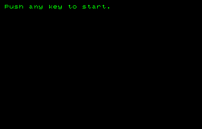
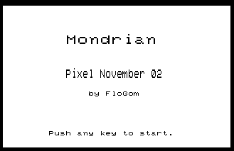
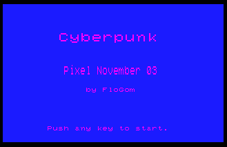
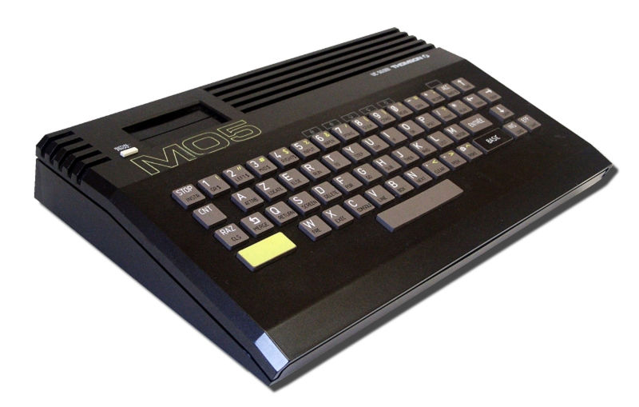

# Pixel November

## Goal

\#PixelNovember is an artistic challenge to make use of old computers like the Thomson MO5.

The artwork is either fix or interactive.

Each day of November a new program will be uploaded with some screenshots of the artwork.

## Example

### 1st November: Matrix

### 2nd November: Mondrian

### 3rd November: Cyberpunk

## Technical details

The BASIC program are developped for the french microcomputer Thomson MO5, runnning a Microsoft Basic 1.0. All program are tested and developped in the emulator DCMOTO available [here](http://dcmoto.free.fr/).

The emulation screen is captured thanks to [ScreenToGif](https://www.screentogif.com/downloads). 

 This work is licensed under a <a rel="license" href="http://creativecommons.org/licenses/by-nc/4.0/">Creative Commons Attribution-NonCommercial 4.0 International License</a>.